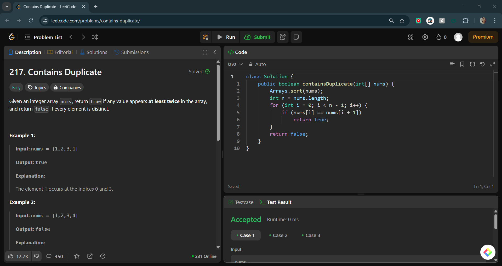

# Contains Duplicate

## 📝 Problem Statement

### 🔗 Problem Link

> *[LeetCode Problem](https://leetcode.com/problems/contains-duplicate/description/)*

> Given an integer array nums, return true if any value appears at least twice in the array, and return false if every element is distinct.
>
> **Example 1:**
>
> **Input:** nums = [1,2,3,1]  
> **Output:** true  
> **Explanation:** The element 1 occurs at the indices 0 and 3.
>
> **Example 2:**
>
> **Input:** nums = [1,2,3,4]  
> **Output:** false  
> **Explanation:** All elements are distinct.
>
> **Example 3:**
>
> **Input:** nums = [1,1,1,3,3,4,3,2,4,2]  
> **Output:** true  
>
> **Constraints:**
>
> - 1 <= nums.length <= 10⁵  
> - -10⁹ <= nums[i] <= 10⁹  

---

## 🛩️ Approach 1: Sorting

### 🔍 Idea

- Sort the array and check if there are any adjacent duplicate elements.

### 🚀 Implementation

```java
import java.util.Arrays;

public class Solution {
    public boolean containsDuplicate(int[] nums) {
        Arrays.sort(nums);
        int n = nums.length;
        for (int i = 0; i < n - 1; i++) {
            if (nums[i] == nums[i + 1])
                return true;
        }
        return false;
    }
}
```

### ⏳ Complexity Analysis

- **Time Complexity:** `O(n log n)`
- **Space Complexity:** `O(1)` (or `O(n)` depending on sorting algorithm)

### 📸 LeetCode Screenshot


---

## 🛩️ Approach 2: Hash Set

### 🔍 Idea

- Use a hash set to store numbers and check if a duplicate appears.

### 🚀 Implementation

```java
import java.util.HashSet;
import java.util.Set;

public class Solution {
    public boolean containsDuplicate(int[] nums) {
        Set<Integer> seen = new HashSet<>();
        for (int num : nums) {
            if (seen.contains(num))
                return true;
            seen.add(num);
        }
        return false;
    }
}
```

### ⏳ Complexity Analysis

- **Time Complexity:** `O(n)`
- **Space Complexity:** `O(n)`

### 📸 LeetCode Screenshot

