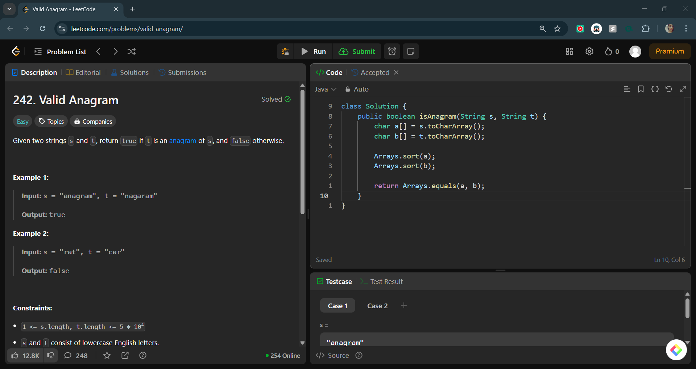
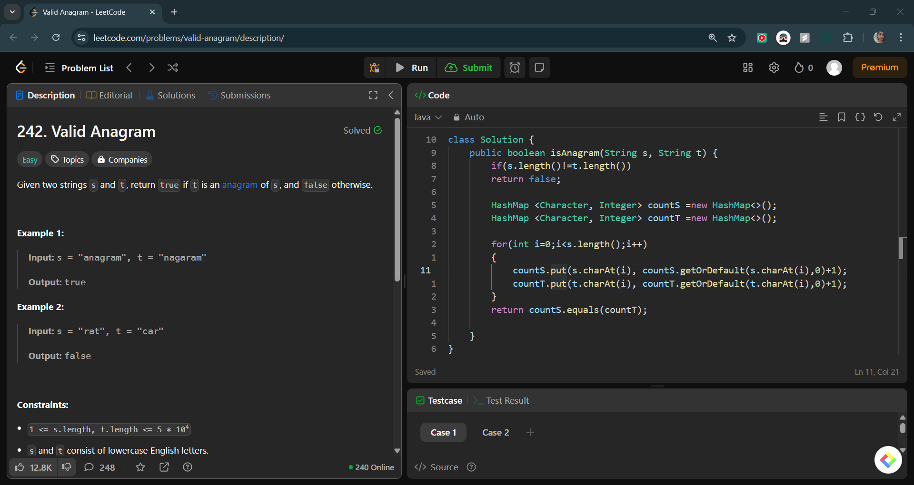

# Valid Anagram

## 📝 Problem Statement

### 🔗 Problem Link

> *[LeetCode Problem](https://leetcode.com/problems/valid-anagram/description/)*

> Given two strings s and t, return true if t is an anagram of s, and false otherwise.
>
> **Example 1:**
>
> **Input:** s = "anagram", t = "nagaram"  
> **Output:** true  
>
> **Example 2:**
>
> **Input:** s = "rat", t = "car"  
> **Output:** false  
>
> **Constraints:**
>
> - 1 <= s.length, t.length <= 5 * 10⁴  
> - s and t consist of lowercase English letters.  

---

## 🛩️ Approach 1: Sorting

### 🔍 Idea

- Convert both strings into character arrays, sort them, and compare them for equality.

### 🚀 Implementation

```java
import java.util.Arrays;

public class Solution {
    public boolean isAnagram(String s, String t) {
        char a[] = s.toCharArray();
        char b[] = t.toCharArray();

        Arrays.sort(a);
        Arrays.sort(b);

        return Arrays.equals(a, b);
    }
}
```

### ⏳ Complexity Analysis

- **Time Complexity:** `O(n log n + m log m)`
- **Space Complexity:** `O(1)` (or `O(n + m)` depending on sorting algorithm)

### 📸 LeetCode Screenshot


---

## 🛩️ Approach 2: Hash Table

### 🔍 Idea

- Use a hash table to count the occurrences of characters in both strings and compare them.

### 🚀 Implementation

```java
import java.util.HashMap;

public class Solution {
    public boolean isAnagram(String s, String t) {
        if(s.length() != t.length())
            return false;

        HashMap<Character, Integer> countS = new HashMap<>();
        HashMap<Character, Integer> countT = new HashMap<>();

        for(int i = 0; i < s.length(); i++) {
            countS.put(s.charAt(i), countS.getOrDefault(s.charAt(i), 0) + 1);
            countT.put(t.charAt(i), countT.getOrDefault(t.charAt(i), 0) + 1);
        }
        return countS.equals(countT);
    }
}
```

### ⏳ Complexity Analysis

- **Time Complexity:** `O(n + m)`
- **Space Complexity:** `O(1)` since we have at most 26 different characters.

### 📸 LeetCode Screenshot


