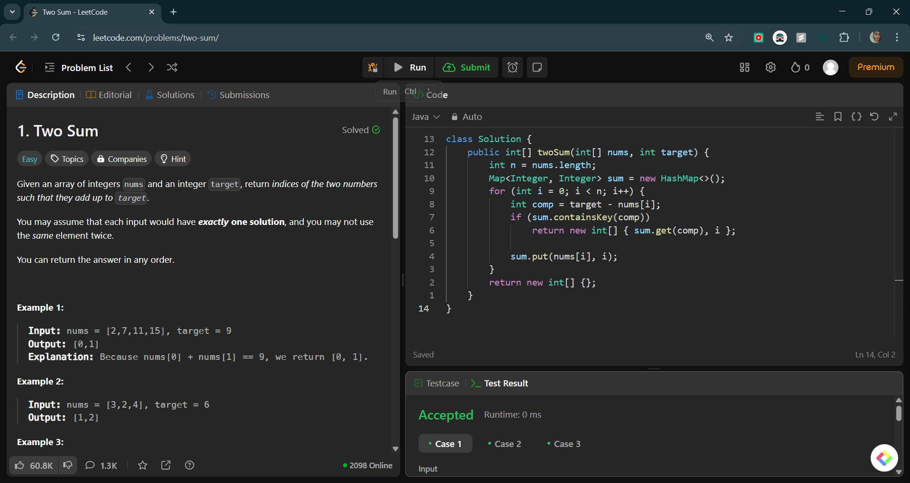

# Two Sum

## 📝 Problem Statement

### 🔗 Problem Link

> *[LeetCode Problem](https://leetcode.com/problems/two-sum/description/)*

> Given an array of integers `nums` and an integer `target`, return indices of the two numbers such that they add up to `target`.
>
> You may assume that each input would have exactly one solution, and you may not use the same element twice.
>
> You can return the answer in any order.
>
> **Example 1:**
>
> **Input:** nums = [2,7,11,15], target = 9  
> **Output:** [0,1]  
> **Explanation:** Because nums[0] + nums[1] == 9, we return [0, 1].
>
> **Example 2:**
>
> **Input:** nums = [3,2,4], target = 6  
> **Output:** [1,2]  
>
> **Example 3:**
>
> **Input:** nums = [3,3], target = 6  
> **Output:** [0,1]  
>
> **Constraints:**
>
> - 2 <= nums.length <= 10⁴  
> - -10⁹ <= nums[i] <= 10⁹  
> - -10⁹ <= target <= 10⁹  
> - Only one valid answer exists.  

---

## 🛩️ Approach 1: Brute Force

### 🔍 Idea

- Use a nested loop to check all pairs of numbers to see if they sum to the target.

### 🚀 Implementation

```java
public class Solution {
    public int[] twoSum(int[] nums, int target) {
        int n = nums.length;
        for (int i = 0; i < n; i++) {
            for (int j = i + 1; j < n; j++) {
                if (nums[i] + nums[j] == target)
                    return new int[] { i, j };
            }
        }
        return new int[0];
    }
}
```

### ⏳ Complexity Analysis

- **Time Complexity:** `O(n²)`
- **Space Complexity:** `O(1)`

### 📸 LeetCode Screenshot


---

## 🛩️ Approach 2: Hash Map

### 🔍 Idea

- Use a hash map to store the indices of numbers as we iterate through the array.
- Check if the complement (target - current number) exists in the map.

### 🚀 Implementation

```java
import java.util.HashMap;
import java.util.Map;

public class Solution {
    public int[] twoSum(int[] nums, int target) {
        int n = nums.length;
        Map<Integer, Integer> sum = new HashMap<>();
        for (int i = 0; i < n; i++) {
            int comp = target - nums[i];
            if (sum.containsKey(comp))
                return new int[] { sum.get(comp), i };

            sum.put(nums[i], i);
        }
        return new int[] {};
    }
}
```

### ⏳ Complexity Analysis

- **Time Complexity:** `O(n)`
- **Space Complexity:** `O(n)`

### 📸 LeetCode Screenshot


