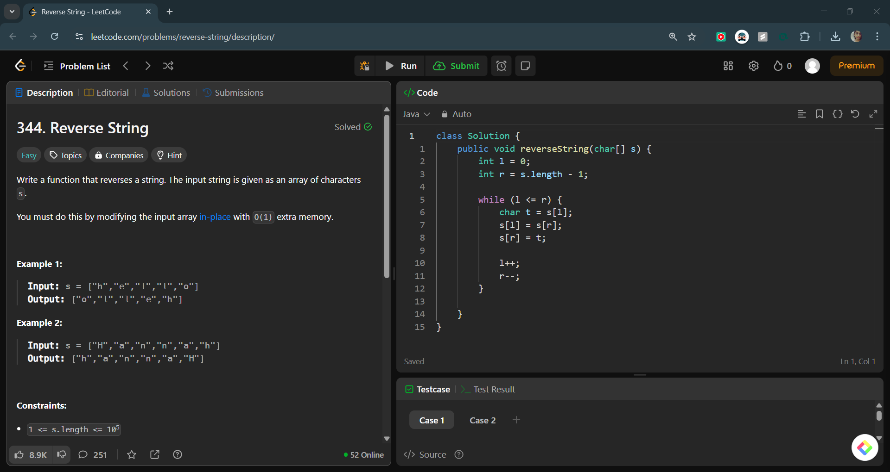

# Reverse String

## 📝 Problem Statement

### 🔗 Problem Link

> *LeetCode Problem*

> Write a function that reverses a string. The input string is given as an array of characters s.
>
> You must do this by modifying the input array in-place with O(1) extra memory.
>
> **Example 1:**
>
> **Input:** s = ["h","e","l","l","o"]\
> **Output:** ["o","l","l","e","h"]
>
> **Example 2:**
>
> **Input:** s = ["H","a","n","n","a","h"]\
> **Output:** ["h","a","n","n","a","H"]
>
> **Constraints:**
>
> - 1 <= s.length <= 10⁵
> - s[i] is a printable ASCII character.

---

## 🛩️ Approach 1: Built-In Function

### 🔍 Idea

- Convert the array to a list and use `Collections.reverse()`.

### 🚀 Implementation

```java
public class Solution {
    public void reverseString(char[] s) {
        List<Character> list = new ArrayList<>();
        for (char c : s) {
            list.add(c);
        }
        Collections.reverse(list);
        
        for (int i = 0; i < s.length; i++) {
            s[i] = list.get(i);
        }
    }
}
```

### ⏳ Complexity Analysis

- **Time Complexity:** `O(n)`
- **Space Complexity:** `O(1)`

### 📸 LeetCode Screenshot


---

## 🛩️ Approach 2: Two Pointers

### 🔍 Idea

- Swap characters using two pointers moving towards the center.

### 🚀 Implementation

```java
class Solution {
    public void reverseString(char[] s) {
        int l = 0;
        int r = s.length - 1;

        while (l <= r) {
            char t = s[l];
            s[l] = s[r];
            s[r] = t;

            l++;
            r--;
        }
    }
}
```

### ⏳ Complexity Analysis

- **Time Complexity:** `O(n)`
- **Space Complexity:** `O(1)`

### 📸 LeetCode Screenshot


